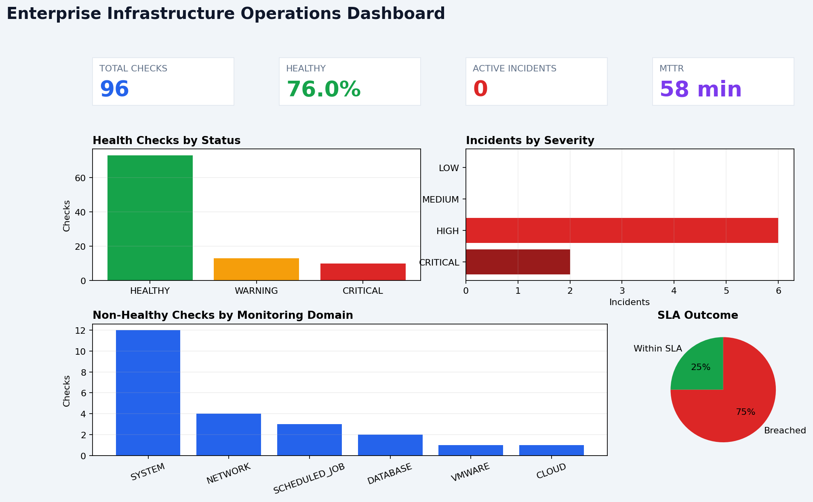
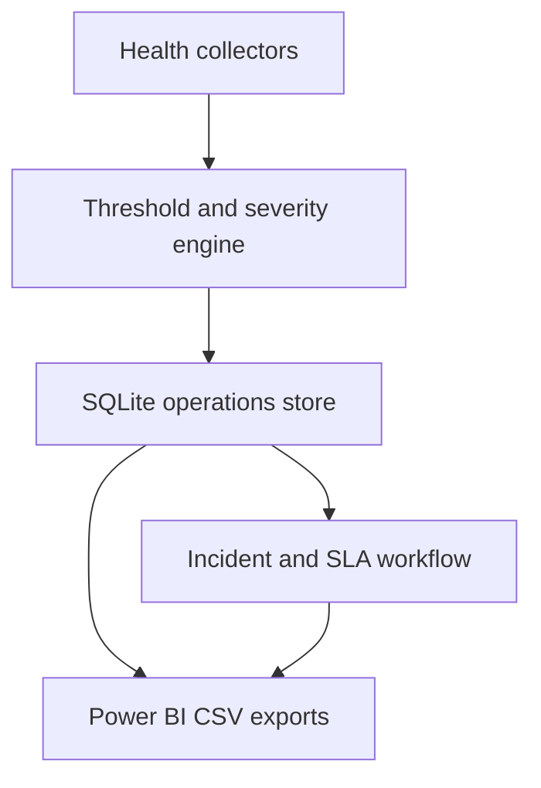

# Enterprise Infrastructure Monitoring & Incident Management

[](https://www.python.org/)
[](tests/)
[](LICENSE)

A portfolio-grade operations lab that monitors infrastructure health, converts alerts into trackable incidents, applies SLA-based escalation, and publishes operational datasets for Power BI.

The default configuration is safe to run on a laptop. It performs real local system and database checks. A deterministic demo mode produces repeatable failure and recovery scenarios for screenshots, testing, and interviews without requiring production infrastructure.



## What the project demonstrates

| Capability | Implementation |
|---|---|
| Server monitoring | CPU, memory, and disk utilization with configurable warning/critical thresholds |
| Network monitoring | TCP availability and response-time checks for configurable endpoints |
| Database monitoring | Availability and query-response validation using a portable SQLite lab database |
| Scheduled-job monitoring | Heartbeat-file age validation for batch jobs such as a simulated JDE daily job |
| Incident management | Alert deduplication, severity assignment, acknowledgement, resolution, and event history |
| SLA workflow | Severity-based due times and automatic multi-level escalation when an SLA is breached |
| CMDB simulation | Asset inventory with ownership, environment, location, status, and criticality |
| Operations reporting | Six CSV datasets, SQL queries, DAX measures, a Power BI theme, and daily/SLA summaries |
| Automation | Python orchestration plus standalone PowerShell and Bash health-check scripts |
| Optional integrations | Read-only VMware vCenter, AWS CloudWatch, and Azure Monitor CLI collectors |

## Architecture



See [architecture.md](docs/architecture.md) for component and data-flow details.

## Quick start

### Windows PowerShell

```powershell
py -m venv .venv
.\.venv\Scripts\Activate.ps1
python -m pip install -e ".[dev]"
python -m infra_monitor --config config/config.example.yaml demo --reset
pytest
```

### Linux or macOS

```bash
python3 -m venv .venv
source .venv/bin/activate
python -m pip install -e ".[dev]"
python -m infra_monitor --config config/config.example.yaml demo --reset
pytest
```

The demo runs 12 simulated monitoring cycles, writes data to `data/monitoring.db`, creates and escalates incidents, records recoveries, and refreshes `powerbi/data/*.csv`.

## Run real local checks

The example configuration enables real CPU, memory, disk, and SQLite checks:

```bash
python -m infra_monitor --config config/config.example.yaml init-db
python -m infra_monitor --config config/config.example.yaml monitor --cycles 1
python -m infra_monitor --config config/config.example.yaml export
python -m infra_monitor --config config/config.example.yaml incidents
```

To run repeatedly, set `--cycles` and `--interval`:

```bash
python -m infra_monitor --config config/config.example.yaml monitor --cycles 10 --interval 60
```

## Incident operations

```bash
# List all incident records
infra-monitor --config config/config.example.yaml incidents

# Acknowledge an active incident
infra-monitor --config config/config.example.yaml acknowledge INC-20260929-AB12CD34

# Resolve an active incident with an audit note
infra-monitor --config config/config.example.yaml resolve INC-20260929-AB12CD34 \
  --note "Freed disk space and validated application health"
```

Every lifecycle change is recorded in `incident_events`, providing a simple audit trail. The detailed workflow is in [incident_management.md](docs/incident_management.md).

## Power BI dashboard

Run the demo or `export`, then import these files from `powerbi/data/`:

- `assets.csv`
- `health_checks.csv`
- `incidents.csv`
- `incident_events.csv`
- `daily_status.csv`
- `sla_summary.csv`

Use [powerbi/README.md](powerbi/README.md) for relationships and dashboard pages, [measures.dax](powerbi/measures.dax) for calculated measures, and [operations-theme.json](powerbi/operations-theme.json) for styling. The image above is a preview generated from the same exported data; the repository does not claim that a `.pbix` file is source-controllable.

## Real checks versus lab simulation

| Area | Default behavior | How to enable more |
|---|---|---|
| Windows/Linux host | Real local `psutil` readings | Deploy the scripts through Task Scheduler or cron |
| Database | Real query against a local SQLite database | Add a collector for the target database driver |
| Network | Disabled to avoid external dependency | Enable a TCP endpoint in YAML |
| Scheduled jobs | Disabled until a heartbeat path is supplied | Configure a job to update the heartbeat after success |
| AWS/Azure | Disabled; no credentials included | Authenticate the provider CLI and enable the collector |
| VMware | Disabled; no credentials included | Install `.[vmware]`, use a read-only vCenter account, and enable it |
| Demo | Deterministic lab data | Run `demo --reset` at any time |

No secrets or production data are included. Optional integration credentials are read from environment variables.

## Repository structure

```text
src/infra_monitor/       Python monitoring and incident engine
scripts/                 PowerShell, Bash, cleanup, and dashboard utilities
config/                  Safe example configuration
sql/                     Schema and operations queries
powerbi/                 CSV datasets, DAX measures, model guide, and theme
docs/                    Architecture, runbook, GitHub, and interview guides
tests/                   Unit and end-to-end lifecycle tests
.github/workflows/       CI lint, test, coverage, and demo execution
```

## Quality controls

```bash
ruff check src tests scripts
pytest --cov=infra_monitor --cov-report=term-missing
```

GitHub Actions executes linting, tests, coverage, and the full demo on Python 3.10 and 3.12.

## Documentation

- [Operational runbook](docs/runbook.md)
- [Incident and SLA workflow](docs/incident_management.md)
- [Verified project evidence](docs/project_evidence.md)
- [Power BI build guide](powerbi/README.md)
- [Five-minute interview walkthrough](docs/interview_walkthrough.md)
- [GitHub publishing steps](docs/github_setup.md)
- [Security guidance](SECURITY.md)

## Scope

This is a lab and portfolio project, not a replacement for enterprise platforms such as SCOM, SolarWinds, vRealize Operations, or ServiceNow. Its purpose is to demonstrate monitoring fundamentals, automation, first-level triage, incident lifecycle design, SLA awareness, reporting, and operational documentation with code that can be reviewed and run.

## License

[MIT](LICENSE)
