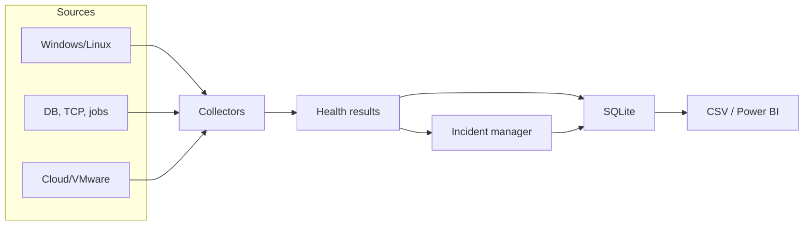
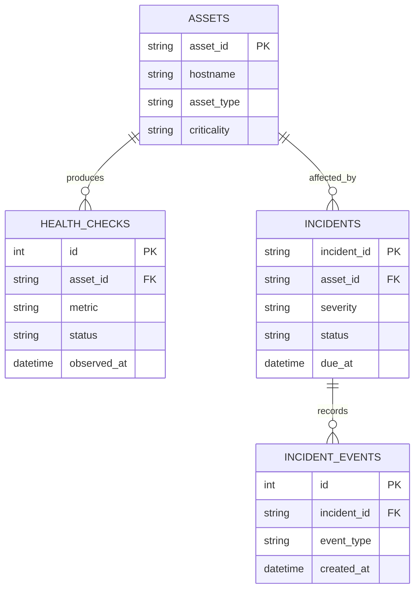

# Architecture

## Design goals

The solution is intentionally small enough to run on a laptop while preserving the same separation of concerns used in larger operations platforms: collection, classification, persistence, incident workflow, escalation, and reporting.

## Components

| Component | Responsibility |
|---|---|
| `checks/` | Collect measurements and normalize them into `HealthResult` records |
| `alerting.py` | Convert numeric measurements into healthy, warning, or critical states |
| `storage.py` | Maintain CMDB, health history, incidents, and lifecycle events in SQLite |
| `incidents.py` | Deduplicate alerts, assign SLAs, escalate breaches, and resolve recoveries |
| `runner.py` | Build configured collectors and execute one monitoring cycle |
| `reporting.py` | Produce a stable CSV contract for Power BI or Excel |
| `cli.py` | Expose initialization, monitoring, demo, incident, and export operations |

## Data model

## Incident correlation

The correlation fingerprint is `asset_id + check_type + metric`. A repeated unhealthy check updates the same active incident instead of opening duplicates. A healthy result with the same fingerprint automatically closes the active incident when `auto_resolve` is enabled.

## Portability

- SQLite avoids requiring a database server for the lab.
- YAML separates thresholds, assets, and collector settings from code.
- `psutil` provides cross-platform host metrics.
- Provider integrations are optional and imported only when enabled.
- CSV is the stable handoff format for Power BI.

