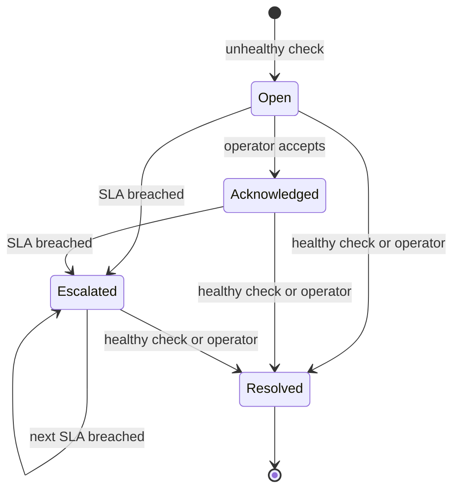

# Incident and SLA Workflow

## Lifecycle

## Default SLA targets

| Severity | Initial response target |
|---|---:|
| Critical | 15 minutes |
| High | 30 minutes |
| Medium | 120 minutes |
| Low | 480 minutes |

Targets are configured in YAML. When a due time passes, the incident status becomes `ESCALATED`, the escalation level increases, and an event is recorded. The next due time is set to half the original SLA, with a minimum of 15 minutes.

## Severity rules

- Critical threshold breach: `CRITICAL` status and critical severity.
- Warning threshold breach: `WARNING` status and high severity.
- Healthy measurement: informational severity.
- Collector cannot determine state: `UNKNOWN`; it is stored for investigation but does not automatically create an incident.

## First-level triage checklist

1. Confirm the alert time, asset, metric, value, and threshold.
2. Check whether related assets or metrics failed at the same time.
3. Validate reachability and recent changes.
4. Review CPU, memory, disk, network, database, and scheduled-job context.
5. Acknowledge the incident and record evidence.
6. Apply only approved first-line remediation from the runbook.
7. Validate recovery with a new health check.
8. Escalate before the SLA if access, ownership, or technical scope blocks recovery.
9. Add a clear resolution note or handoff summary.

## Audit data

The `incident_events` table records creation, repeated alerts, acknowledgement, escalation, and resolution. It provides a simple timeline for Power BI and interview demonstrations.

